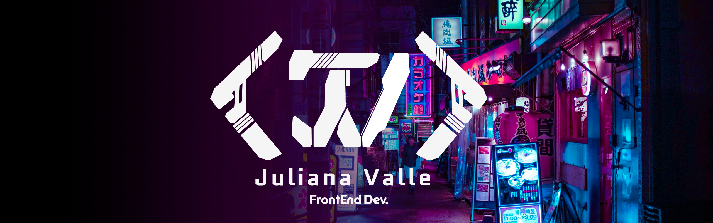

  
<h1 align="center">Oiii!! , eu sou a Juliana Valle</h1>
<!--
  
-->

  

 

🌐 Desenvolvedora Full-Stack | 👾 Exploradora de AR/VR | 🛠️ Generalista em Tecnologia

- **Web Development:** React, Typescript, NodeJS, ThreeJS
- **DevOps & Infra:** Docker, GitHub Actions
- **Realidade Aumentada e Virtual:** Unity, Unreal Engine, MindAR, Zappar, 8th Wall 
- **Automação e Scripts:** Python
- **Design de Experiências Imersivas:** UX para AR/VR, Interações em 3D
  
## 🛠 &nbsp;Tech Stack
 
  

 

  

  
## ⚙️ &nbsp;GitHub Analytics
  

 
  
<!-- 
-->  
</div

  

